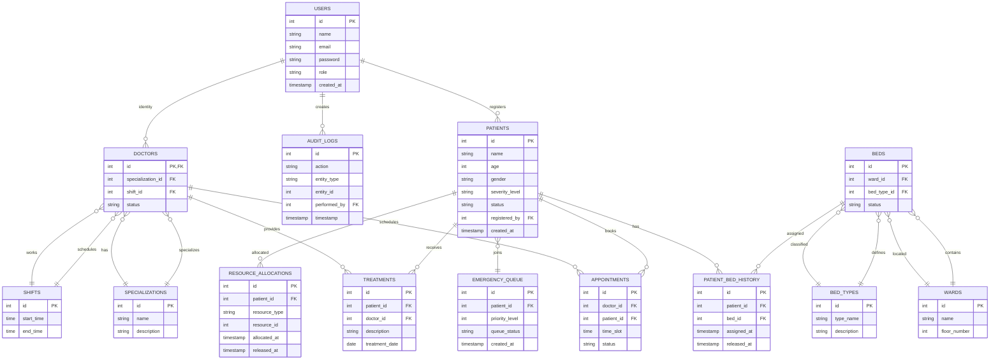

# ER-Diagram

```mermaid
erDiagram
    USERS ||--o{ PATIENTS : registers
    USERS ||--o{ AUDIT_LOGS : creates
    USERS ||--o{ DOCTORS : identity
    DOCTORS ||--o{ APPOINTMENTS : schedules
    DOCTORS ||--o{ TREATMENTS : provides
    DOCTORS }o--|| SPECIALIZATIONS : has
    DOCTORS }o--|| SHIFTS : works
    PATIENTS ||--o{ APPOINTMENTS : books
    PATIENTS ||--o{ TREATMENTS : receives
    PATIENTS ||--o{ PATIENT_BED_HISTORY : has
    PATIENTS }o--|| EMERGENCY_QUEUE : joins
    PATIENTS ||--o{ RESOURCE_ALLOCATIONS : allocated
    BEDS ||--o{ PATIENT_BED_HISTORY : assigned
    BEDS }o--|| WARDS : located
    BEDS }o--|| BED_TYPES : classified
    WARDS ||--o{ BEDS : contains
    BED_TYPES ||--o{ BEDS : defines
    SPECIALIZATIONS ||--o{ DOCTORS : specializes
    SHIFTS ||--o{ DOCTORS : schedules

    USERS {
        int id PK
        string name
        string email
        string password
        string role
        timestamp created_at
    }

    DOCTORS {
        int id PK, FK
        int specialization_id FK
        int shift_id FK
        string status
    }

    SPECIALIZATIONS {
        int id PK
        string name
        string description
    }

    SHIFTS {
        int id PK
        time start_time
        time end_time
    }

    PATIENTS {
        int id PK
        string name
        int age
        string gender
        string severity_level
        string status
        int registered_by FK
        timestamp created_at
    }

    BEDS {
        int id PK
        int ward_id FK
        int bed_type_id FK
        string status
    }

    BED_TYPES {
        int id PK
        string type_name
        string description
    }

    WARDS {
        int id PK
        string name
        int floor_number
    }

    PATIENT_BED_HISTORY {
        int id PK
        int patient_id FK
        int bed_id FK
        timestamp assigned_at
        timestamp released_at
    }

    APPOINTMENTS {
        int id PK
        int doctor_id FK
        int patient_id FK
        time time_slot
        string status
    }

    EMERGENCY_QUEUE {
        int id PK
        int patient_id FK
        int priority_level
        string queue_status
        timestamp created_at
    }

    TREATMENTS {
        int id PK
        int patient_id FK
        int doctor_id FK
        string description
        date treatment_date
    }

    AUDIT_LOGS {
        int id PK
        string action
        string entity_type
        int entity_id
        int performed_by FK
        timestamp timestamp
    }

    RESOURCE_ALLOCATIONS {
        int id PK
        int patient_id FK
        string resource_type
        int resource_id
        timestamp allocated_at
        timestamp released_at
    }


```
