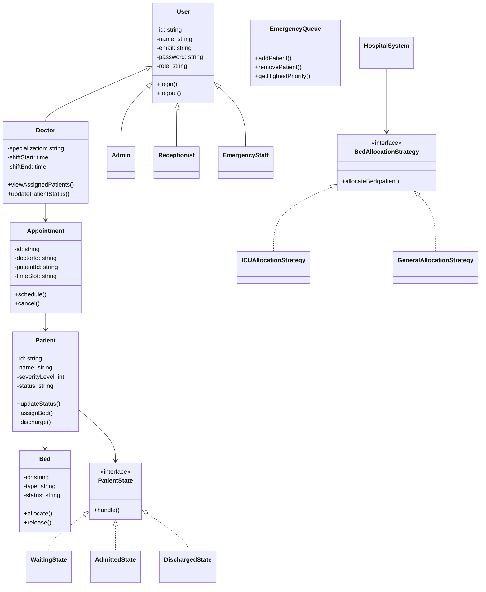

# Class Diagram

```mermaid
classDiagram
    class User {
        -id: string
        -name: string
        -email: string
        -password: string
        -role: string
        +login()
        +logout()
    }
    
    class Doctor {
        -specialization: string
        -shiftStart: time
        -shiftEnd: time
        +viewAssignedPatients()
        +updatePatientStatus()
    }
    
    class Admin {
    }
    
    class Receptionist {
    }
    
    class EmergencyStaff {
    }
    
    class Patient {
        -id: string
        -name: string
        -severityLevel: int
        -status: string
        +updateStatus()
        +assignBed()
        +discharge()
    }
    
    class Bed {
        -id: string
        -type: string
        -status: string
        +allocate()
        +release()
    }
    
    class Appointment {
        -id: string
        -doctorId: string
        -patientId: string
        -timeSlot: string
        +schedule()
        +cancel()
    }
    
    class EmergencyQueue {
        +addPatient()
        +removePatient()
        +getHighestPriority()
    }
    
    class BedAllocationStrategy {
        <<interface>>
        +allocateBed(patient)
    }
    
    class ICUAllocationStrategy {
    }
    
    class GeneralAllocationStrategy {
    }
    
    class PatientState {
        <<interface>>
        +handle()
    }
    
    class WaitingState {
    }
    
    class AdmittedState {
    }
    
    class DischargedState {
    }
    
    class HospitalSystem {
    }
    
    User <|-- Doctor
    User <|-- Admin
    User <|-- Receptionist
    User <|-- EmergencyStaff
    BedAllocationStrategy <|.. ICUAllocationStrategy
    BedAllocationStrategy <|.. GeneralAllocationStrategy
    PatientState <|.. WaitingState
    PatientState <|.. AdmittedState
    PatientState <|.. DischargedState
    Patient --> PatientState
    Patient --> Bed
    Doctor --> Appointment
    Appointment --> Patient
    HospitalSystem --> BedAllocationStrategy

```
