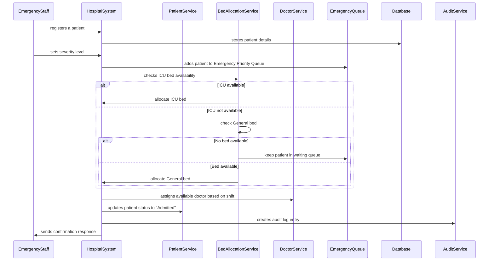

# Sequence Diagram

```mermaid
sequenceDiagram
    participant EmergencyStaff
    participant HospitalSystem
    participant PatientService
    participant BedAllocationService
    participant DoctorService
    participant EmergencyQueue
    participant Database
    participant AuditService

    EmergencyStaff ->> HospitalSystem: registers a patient
    HospitalSystem ->> Database: stores patient details
    EmergencyStaff ->> HospitalSystem: sets severity level
    HospitalSystem ->> EmergencyQueue: adds patient to Emergency Priority Queue
    HospitalSystem ->> BedAllocationService: checks ICU bed availability
    alt ICU available
        BedAllocationService ->> HospitalSystem: allocate ICU bed
    else ICU not available
        BedAllocationService ->> BedAllocationService: check General bed
        alt No bed available
            BedAllocationService ->> EmergencyQueue: keep patient in waiting queue
        else Bed available
            BedAllocationService ->> HospitalSystem: allocate General bed
        end
    end
    HospitalSystem ->> DoctorService: assigns available doctor based on shift
    HospitalSystem ->> PatientService: updates patient status to "Admitted"
    HospitalSystem ->> AuditService: creates audit log entry
    HospitalSystem ->> EmergencyStaff: sends confirmation response

```
