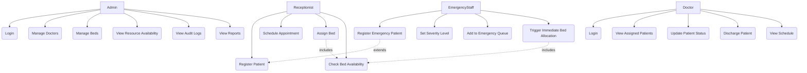

# Use Case Diagram 

```mermaid
graph TD
    Admin[Admin]
    Doctor[Doctor]
    Receptionist[Receptionist]
    EmergencyStaff[EmergencyStaff]
    
    Login1(Login)
    ManageDoctors(Manage Doctors)
    ManageBeds(Manage Beds)
    ViewResourceAvailability(View Resource Availability)
    ViewAuditLogs(View Audit Logs)
    ViewReports(View Reports)
    
    RegisterPatient(Register Patient)
    ScheduleAppointment(Schedule Appointment)
    AssignBed(Assign Bed)
    CheckBedAvailability(Check Bed Availability)
    
    RegisterEmergencyPatient(Register Emergency Patient)
    SetSeverityLevel(Set Severity Level)
    AddToEmergencyQueue(Add to Emergency Queue)
    TriggerImmediateBedAllocation(Trigger Immediate Bed Allocation)
    
    Login2(Login)
    ViewAssignedPatients(View Assigned Patients)
    UpdatePatientStatus(Update Patient Status)
    DischargePatient(Discharge Patient)
    ViewSchedule(View Schedule)
    
    Admin --> Login1
    Admin --> ManageDoctors
    Admin --> ManageBeds
    Admin --> ViewResourceAvailability
    Admin --> ViewAuditLogs
    Admin --> ViewReports
    
    Receptionist --> RegisterPatient
    Receptionist --> ScheduleAppointment
    Receptionist --> AssignBed
    Receptionist --> CheckBedAvailability
    
    EmergencyStaff --> RegisterEmergencyPatient
    EmergencyStaff --> SetSeverityLevel
    EmergencyStaff --> AddToEmergencyQueue
    EmergencyStaff --> TriggerImmediateBedAllocation
    
    Doctor --> Login2
    Doctor --> ViewAssignedPatients
    Doctor --> UpdatePatientStatus
    Doctor --> DischargePatient
    Doctor --> ViewSchedule
    
    AssignBed -.->|includes| CheckBedAvailability
    TriggerImmediateBedAllocation -.->|includes| CheckBedAvailability
    RegisterEmergencyPatient -.->|extends| RegisterPatient
```
